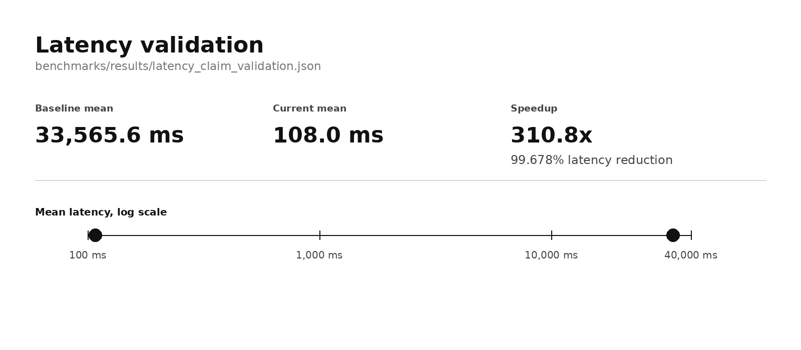
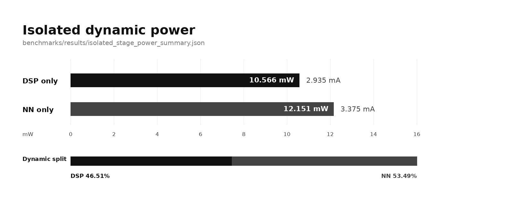
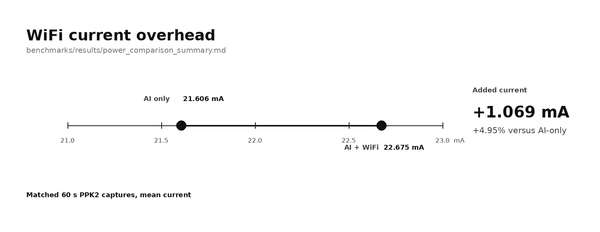
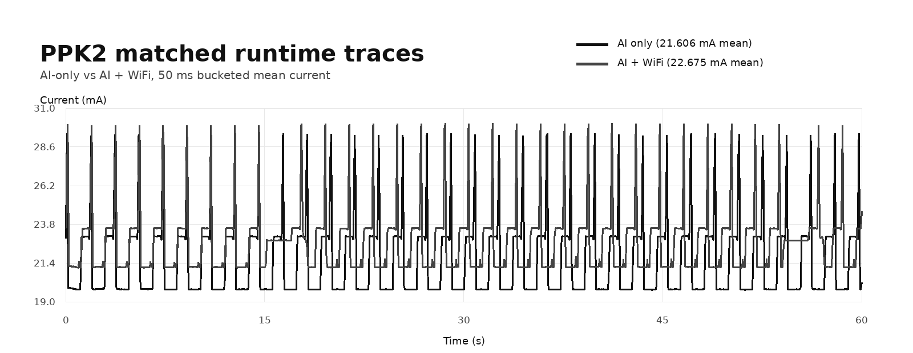
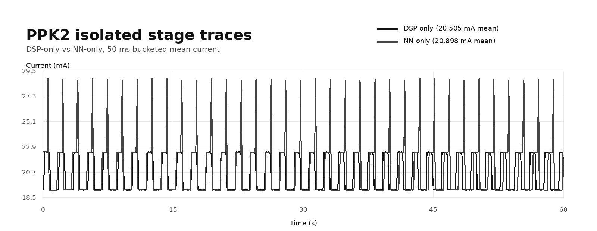

# nRF Benchmarking

nRF Benchmarking is an embedded machine-learning benchmark pipeline for the
nRF5340/nRF7002DK. It covers training-to-deployment, quantization, DSP parity,
inference latency, runtime constraints, WiFi telemetry, and power profiling with
Zephyr RTOS, TensorFlow Lite Micro, CMSIS-DSP, and CMSIS-NN.

```text
audio training data
  -> quantized keyword model
  -> Zephyr firmware
  -> CMSIS-DSP frontend
  -> TFLM inference
  -> UART, WiFi, latency, and power checks
```

Technical guide:
- `docs/EMBEDDED_MACHINE_LEARNING_GUIDE.md` is a project-specific technical walkthrough of the implementation, validation, and measurement flow in this repository.

## System

| Area | Path | Role |
| --- | --- | --- |
| firmware | `firmware/` | Zephyr app, DSP frontend, inference runtime, IPC, WiFi telemetry |
| training | `training/` | model training, quantization, tensor export, parity checks |
| benchmarks | `benchmarks/` | UART capture, latency checks, power analysis, runtime verification |
| retained outputs | `benchmarks/results/`, `training/outputs/` | JSON summaries, logs, models, and generated summaries |
| docs | `docs/` | guide, claims map, visual summaries, setup notes |
| architecture | `ARCHITECTURE.md` | implementation overview and runtime paths |

## What Works

- End-to-end training to deployment pipeline (Python -> int8 model -> firmware integration)
- DSP frontend (16 kHz audio -> 49x40 log-mel)
- TFLM int8 inference runtime
- Optional dual-core DSP offload (CPUAPP <-> CPUNET via OpenAMP/RPMsg)
- WiFi UDP telemetry path
- Validation scripts for quantization, latency, numerical parity, runtime constraints, telemetry, and power analysis

## Current Results

Source outputs:
- `training/outputs/quantization_accuracy_summary.json`
- `benchmarks/results/latency_claim_validation.json`
- `training/outputs/numerical_equivalence_cross_impl_summary.json`
- `training/outputs/quantized_cross_platform_summary.json`
- `benchmarks/results/dual_core_runtime_summary.json`

Headline values:
- Quantization drop: `-0.5878 pp` (FP32 `91.62%` -> INT8 `92.21%`), pass for `<2 pp` target
- Latency claim validation: baseline `33565.625 ms`, current `108.0 ms`, speedup `310.79x`, reduction `99.678%`
- DSP cross-implementation summary: `bit_exact=true`, `tolerance_pass=true` for the captured reference flow
- Quantized cross-platform parity: `exact_int8_output_match=true`, `behavior_equivalent=true`, max diff `0 LSB`
- Dual-core runtime summary: required markers pass, inference samples captured

Visual summaries:







## Layout

```text
repo/
├── firmware/
│   ├── include/                # Firmware headers
│   ├── src/                    # Main app, DSP, inference, IPC, benchmarks
│   ├── prj.conf                # Base Zephyr config
│   ├── prj_dualcore.conf       # Dual-core + OpenAMP config overlay
│   ├── sysbuild.conf           # Sysbuild options (includes SB_CONFIG_WIFI_NRF70)
│   └── CMakeLists.txt          # Build wiring + mode compile definitions
├── training/
│   ├── scripts/                # Training, quantization, parity, parsing pipelines
│   └── outputs/                # Models and validation summaries
├── benchmarks/
│   ├── *.py                    # UART capture, latency/power analysis, verification
│   ├── traces/                 # Local PPK2 CSV exports; raw captures are too large for Git
│   └── results/                # Generated and retained benchmark summaries
├── ARCHITECTURE.md
└── docs/
    └── CLAIMS_AND_RESULTS.md
```

## Prerequisites

- nRF Connect SDK workspace (tested with NCS 2.9.x)
- Use a local Python environment for `west` and the Python tooling
- Board: nRF7002DK (nRF5340 + nRF7002)
- Python dependencies:

```bash
cd <repo-root>
python3 -m venv .venv
source .venv/bin/activate
pip install -r requirements.txt
```

## Training and Quantization Workflow

```bash
cd <repo-root>
source .venv/bin/activate

python training/scripts/train_audio_model.py
python training/scripts/quantize.py
python training/scripts/evaluate_quantization.py \
  --output training/outputs/quantization_accuracy_summary.json
```

## Firmware Build Modes

Firmware commands assume the nRF Connect SDK toolchain environment is active. Either enter it once:

```bash
export ZEPHYR_BASE="$HOME/ncs/v2.9.3/zephyr"
nrfutil toolchain-manager launch --ncs-version v2.9.3 --shell
```

or prefix one-off commands:

```bash
nrfutil toolchain-manager launch --ncs-version v2.9.3 -- \
  env ZEPHYR_BASE="$HOME/ncs/v2.9.3/zephyr" west --version
```

### 1) Test mode (benchmarks + canned fixtures)

```bash
cd <repo-root>
source .venv/bin/activate
west build -d build_dualcore -b nrf7002dk/nrf5340/cpuapp firmware --pristine -- \
  -DENABLE_TEST_MODE=ON
```

### 2) Production mode (deterministic synthetic frame loop)

```bash
west build -d build_dualcore -b nrf7002dk/nrf5340/cpuapp firmware --pristine
```

### 3) Dual-core DSP offload mode

```bash
west build -d build_dualcore -b nrf7002dk/nrf5340/cpuapp firmware --pristine -- \
  -DENABLE_DUAL_CORE_DSP=ON \
  -DEXTRA_CONF_FILE=firmware/prj_dualcore.conf \
  -DSB_CONFIG_TINYML_DUAL_CORE_DSP=y
```

## Flash + UART

Preferred:
```bash
west flash -d build_dualcore
```

Direct fallback:
```bash
nrfjprog --program build_dualcore/merged.hex \
  --chiperase --verify --reset
```

Common UART device nodes:
- Linux: `/dev/ttyACM0`, `/dev/ttyACM1`

Example capture:
```bash
python benchmarks/capture_inference_uart.py \
  --port /dev/ttyACM1 \
  --seconds 60 \
  --log-out /tmp/uart.log \
  --json-out /tmp/uart.json
```

## Verification Pipelines

### DSP parity pipeline

```bash
python training/scripts/run_bit_exactness_pipeline.py
```

### Quantized parity pipeline

```bash
python training/scripts/run_quantized_parity_pipeline.py
```

### Latency claim validation

```bash
python benchmarks/validate_latency_claim.py \
  --baseline <baseline_json> \
  --current <current_json> \
  --output benchmarks/results/latency_claim_validation.json
```

### Inference runtime constraints check

```bash
python benchmarks/verify_runtime_constraints.py \
  --inference-source firmware/src/inference.cpp \
  --uart-log benchmarks/results/dual_core_runtime_uart.log \
  --summary-out benchmarks/results/runtime_constraints_summary.json
```

### WiFi telemetry summary check

```bash
python benchmarks/verify_wifi_telemetry.py \
  --uart-log /tmp/uart.log \
  --summary-out benchmarks/results/wifi_telemetry_summary.json
```

## WiFi Telemetry Configuration

Credential source (Kconfig):
- `firmware/prj.conf`
  - `CONFIG_WIFI_CREDENTIALS_STATIC_SSID`
  - `CONFIG_WIFI_CREDENTIALS_STATIC_PASSWORD`

Recommended practice:
- Keep tracked `prj.conf` values as placeholders
- Provide real local credentials through an untracked override such as `-DEXTRA_CONF_FILE=firmware/prj.local.conf`

Telemetry destination:
- `firmware/include/wifi_credentials.h`
  - `TELEMETRY_IP`
  - `TELEMETRY_PORT`

Recommended practice:
- Keep tracked destination values generic
- Override them locally before live telemetry testing

Current code behavior:
- Uses `CONNECT_STORED` first
- Falls back to explicit static credentials (PSK/2.4GHz, then auto)
- Uses UDP `connect()` + `send()` path with transient retry handling
- Sends startup and threshold-triggered telemetry depending on compile-time mode macros

## Power Profiling (PPK2)

PPK2 flow is offline CSV analysis:
1. Capture in nRF Connect Power Profiler
2. Export CSV to a local trace directory, typically `benchmarks/traces/`
3. For strict same-run phase attribution, build the native USB console profile and capture the matching UART log from the same firmware run (the firmware emits `PHASE_TIMING dsp_us=... nn_us=... total_us=...` markers by default)
4. Analyze:

```bash
python benchmarks/analyze_power.py \
  --csv benchmarks/traces/<capture>.csv \
  --phase-uart-log benchmarks/results/<capture_uart>.log \
  --require-phase-split \
  --voltage 3.6 \
  --output benchmarks/results/power_summary.json
```

The retained raw PPK2 CSVs are about 166 MB each, so Git tracks generated
summaries and checksums instead of the full exports:

```bash
python benchmarks/generate_power_summaries.py --trace-dir /path/to/ppk2/csv_exports
```

This regenerates:
- `benchmarks/results/power_trace_manifest.json`
- `docs/assets/ppk2-matched-runtime-traces.svg`
- `docs/assets/ppk2-matched-runtime-traces.png`
- `docs/assets/ppk2-isolated-stage-traces.svg`
- `docs/assets/ppk2-isolated-stage-traces.png`

For synchronized PPK2 + UART captures without using the iMCU VCOM path, add the native USB CDC console profile:

```bash
west build -p always -b nrf7002dk/nrf5340/cpuapp firmware -- \
  -DEXTRA_CONF_FILE=firmware/prj_usb_console.conf \
  -DDTC_OVERLAY_FILE=firmware/usb_console.overlay
```

This moves the console to the nRF5340 direct USB port so the board can be powered from PPK2 while logs still come over USB CDC.

If any USB connection still perturbs the PPK2 measurement in your setup, use the software-only isolation path instead of same-run UART. These builds let you capture separate `DSP-only` and `NN-only` traces with PPK2 as the only power source:

```bash
west build -p always -b nrf7002dk/nrf5340/cpuapp firmware -- \
  -DCONF_FILE=firmware/prj_inference_only.conf \
  -DTINYML_INCLUDE_BENCHMARK_SOURCES=OFF \
  -DTINYML_WIFI_RUNTIME=OFF \
  -DTINYML_TELEMETRY_SEND_STARTUP=OFF \
  -DTINYML_TELEMETRY_SEND_TARGET=OFF \
  -DTINYML_TELEMETRY_SEND_PER_FRAME=OFF \
  -DTINYML_POWER_DSP_ONLY=ON
```

```bash
west build -p always -b nrf7002dk/nrf5340/cpuapp firmware -- \
  -DCONF_FILE=firmware/prj_inference_only.conf \
  -DTINYML_INCLUDE_BENCHMARK_SOURCES=OFF \
  -DTINYML_WIFI_RUNTIME=OFF \
  -DTINYML_TELEMETRY_SEND_STARTUP=OFF \
  -DTINYML_TELEMETRY_SEND_TARGET=OFF \
  -DTINYML_TELEMETRY_SEND_PER_FRAME=OFF \
  -DTINYML_POWER_NN_ONLY=ON
```

These modes are mutually exclusive and are intended for offline phase attribution when live UART capture is not electrically practical.

For AI-only power captures, build the constrained runtime profile:

```bash
west build -p always -b nrf7002dk/nrf5340/cpuapp firmware -- \
  -DCONF_FILE=firmware/prj_inference_only.conf \
  -DEXTRA_CONF_FILE=firmware/prj_usb_console.conf \
  -DDTC_OVERLAY_FILE=firmware/usb_console.overlay \
  -DTINYML_INCLUDE_BENCHMARK_SOURCES=OFF
```

Power capture constraints:
- `benchmarks/analyze_power.py` prefers per-frame `PHASE_TIMING` markers over coarse benchmark averages when both are present.
- `firmware/prj_usb_console.conf` + `firmware/usb_console.overlay` provide a native USB CDC console path for synchronized PPK2 captures.
- The retained benchmark summaries and checksum manifest are historical hardware records for prior measurements.

## Known Constraints

- Default production loop uses deterministic synthetic input rather than an external live capture path.
- Quantized parity acceptance gate is behavioral equivalence; strict int8 tensor equality can differ by 1 LSB.
- Hotspot/WiFi behavior can be environment-dependent (SSID visibility, AP policy, association timing).

## Documentation Index

- `ARCHITECTURE.md`
- `docs/CLAIMS_AND_RESULTS.md`
